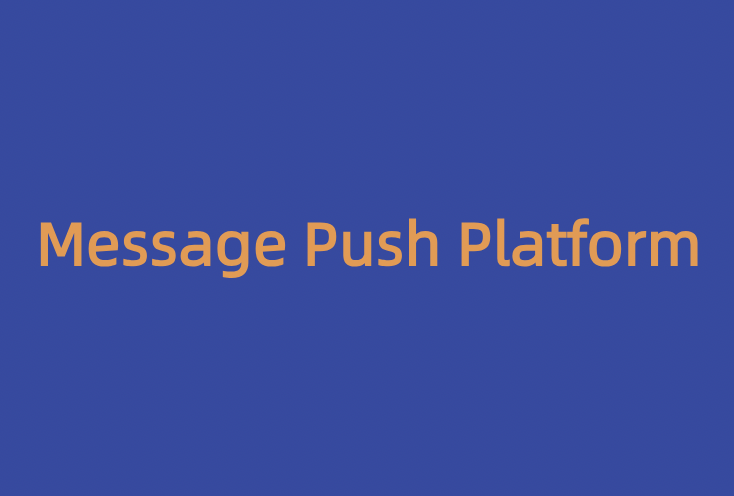
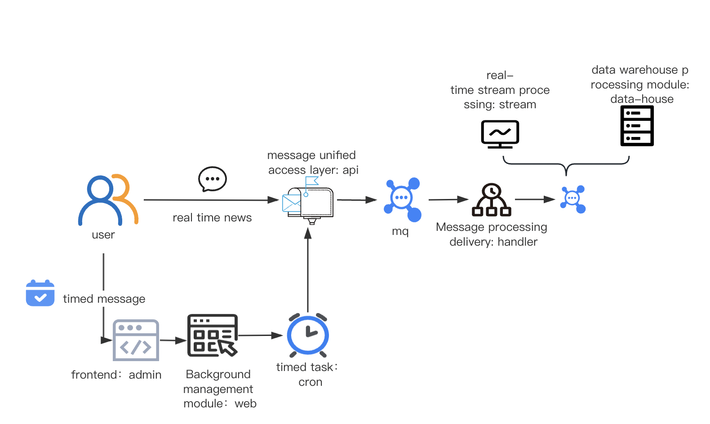

## About Message Push Platform

**Core Functionality**：Send various types of messages, including emails, text messages, WeChat, etc., through a unified interface, and track the message delivery process.

**Significance**：Enterprises requiring message 
delivery should possess a message push platform. This platform facilitates the consolidated sending and administration of diverse message types, minimizing the need for repetitive coding for different message formats.

**Design highlights**：
1. Messages from different channels can be sent, including functions such as timing sending.
2. Different channels and different message types do not affect each other, and the dynamic thread pool can be used to configure and control the consumption capacity.
3. Improved system performance by utilizing Kafka as a message queue to achieve asynchronous and decoupled message processing.
4. Implemented platform-level deduplication using Redis to prevent duplicate sending of identical messages within a short period of time.

**Functional flow chart**：

## How To Deploy
[installing guide(To be perfected)](doc/INSTALL.md)